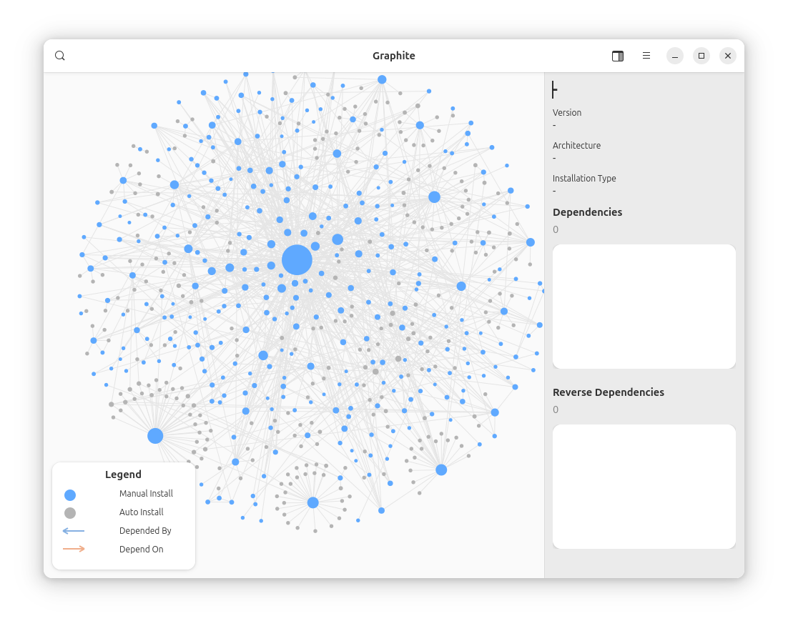

# Graphite

Graphite visualizes the dependencies of locally installed APT packages.



## Features

-   Visualize the entire dependency graph of your system's APT packages.
-   Highlight the dependency subtree for any selected package.
-   Search for specific packages within the graph.
-   Zoom and pan the graph for detailed inspection.
-   Customize graph layout parameters, such as layout iterations and gravity.

## How it works

Graphite generates a directed graph of package dependencies. It begins with all packages [marked as manually installed](https://manpages.debian.org/unstable/apt/apt-mark.8.en.html) and recursively maps out their direct dependencies (predecessors and successors).

## Build

### Prerequisite packages

```bash
# apt install debhelper-compat meson libglib2.0-dev libgtk-4-dev python3-dev desktop-file-utils cython3
```

### Build

```bash
$ dpkg-buildpackage -us -uc -b
```

### Installation

```bash
# dpkg -i ../graphite*.deb
```

## License

This project is licensed under the GNU General Public License v3.0. A copy of the license is available in the `LICENSE` file.
